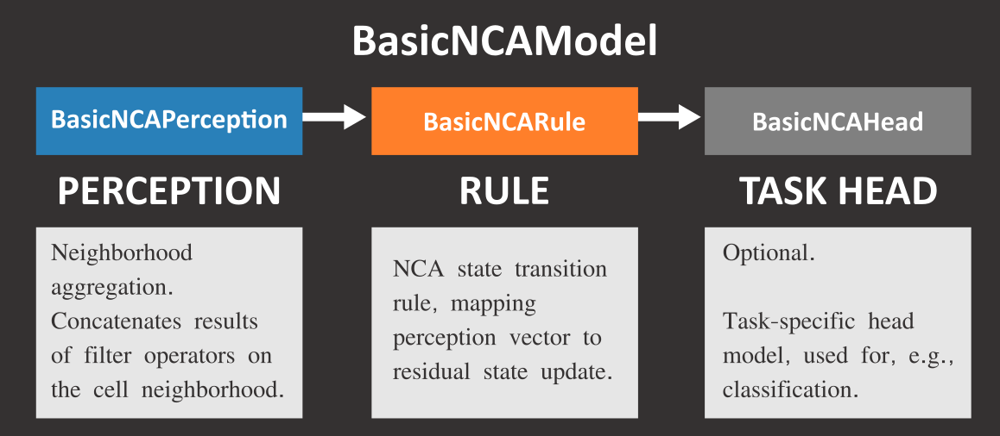

.. title:: Introduction to NCALab
.. author:: Henry Krumb
.. date:: 2025-12-01

======================
Introduction to NCALab
======================

NCA Model Layout
================

In general, the forward pass of an NCA follows a threefold process of 1. perception, 2. computing the
transition function's output and 3. interpreting the residual output.

NCA models are based on the abstract *BasicNCAModel* class, which defines the NCA model's structure.
BasicNCAModel aggregates three classes that resemble the two main components of NCA inference, namely
Perception (neighborhood aggregation filters) and Rule (state transition network), as well as an optional
head model for specialized downstream tasks such as classification.

Perception
----------

Transition Rule
---------------

Task Head
---------

Task head models should subclass the ``BasicNCAHead`` class -- you can take a look at ``ClassificationNCAHead``
to get an understanding of how this class is supposed to work.

For tasks that do not require a separate head, the ``head`` attribute of ``BasicNCAModel`` is simply ``None``.

Subclasses of abstract ``BasicNCAHead`` need to implement the following methods:

1. ``forward()``, takes result of *Rule* network and computes the final prediction.
2. ``freeze()``, freezes the layers of the head model.

Subclassing BasicNCAModel
=========================

Subclasses of BasicNCAModel need to implement the following methods:

1. ``loss()``, which computes a single loss term and may compute multiple subterms.
2. ``metrics()``, which is optional but highly recommended for computing evaluation metrics.

Transfer Learning
=================
