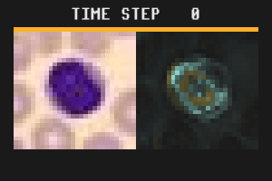
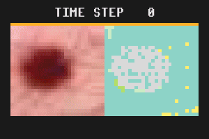
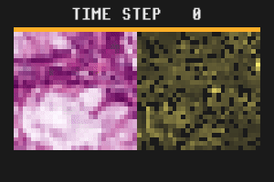

# MedMNIST Classification

This example uses NCAs as classification models for different tasks of [MedMNIST](https://medmnist.com/),
namely BloodMNIST, DermaMNIST, and PathMNIST.







Please note that BloodMNIST and PathMNIST datasets (included in [MedMNIST](https://medmnist.com/)) are licensed under Creative Commons Attribution 4.0 International (CC BY 4.0), and DermaMNIST is licensed under Creative Commons Attribution-NonCommercial 4.0 International (CC BY-NC 4.0).


## Training

### BloodMNIST

Blood cell microscopy dataset, total of 17092 samples.
Full training (50 epochs by default) takes less than 30 minutes on a GeForce RTX 3090.

```bash
uv run python3 tasks/class_medmnist/train_class_bloodmnist.py
```

F1 already reaches >0.90 after a few epochs, so training time can be shortened by passing the `--max-epochs=5` argument
to achieve a reasonable prediction accuracy.


### DermaMNIST

Dermatoscopy dataset with a total of 10015 samples.
Full training (40 epochs by default) takes roughly 40 minutes on a GeForce RTX 3090.

```bash
uv run python3 tasks/class_medmnist/train_class_dermamnist.py
```

### PathMNIST

```bash
uv run python3 tasks/class_medmnist/train_class_pathmnist.py
```
