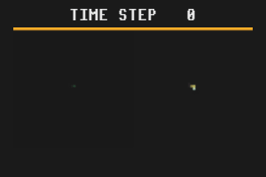

# Growing Emoji NCA

This example is loosely based on the [Growing Cellular Automata](https://distill.pub/2020/growing-ca/) publication that sparked major interest in Neural Cellular Automata.

- Includes hyperparameter search (grid search)
- Finetuning is investigated in `finetune_growing_emoji.py`. The first layer is frozen and only the final layer is re-trained on a different emoji, sacrificing accuracy while decreasing training time on the new task.
- An evaluation script is provided to generate the growing lizard.

## Training

## Evaluation

## Finetuning
